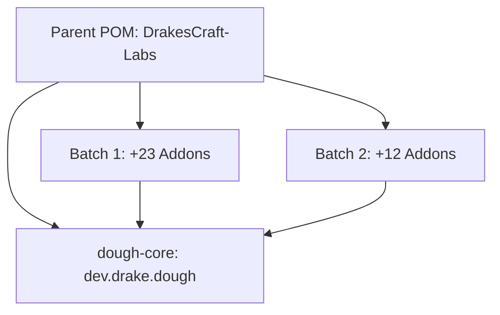

# Arquitectura del Ecosistema DrakesCraft-Labs
**Versión de Referencia:** 1.21.11 | **Package Base:** `dev.drake.dough`

Este repositorio ha sido transformado en un proyecto **Maven Multi-módulo** para centralizar la gestión de más de 35 addons de Slimefun y su librería base, Dough.

## 1. El Núcleo: `dough-core`

Hemos consolidado los 13 sub-módulos originales de la librería Dough en un único módulo robusto llamado `dough-core`.

### Cambios Críticos:
- **Relocalización (Repackaging)**: Todos los paquetes han sido movidos físicamente de `io.github.bakedlibs.dough` a `dev.drake.dough`. Esto garantiza independencia total y evita conflictos de classpath con otros plugins o versiones de Slimefun.
- **Purga de NMS**: Se ha eliminado toda la lógica legacy de adaptadores para versiones antiguas (1.17 - 1.20). El núcleo ahora es nativo para **Paper 1.21.1** y utiliza **Adventure Components** directamente.
- **Persistencia Nativa**: `PersistentDataAPI` ha sido simplificado para centrarse en los **Data Components** de Minecraft 1.21.

## 2. Gestión de Plugins (Addons)

Todos los addons del proyecto ahora heredan de un **Parent POM** global ubicado en la raíz del repositorio.

### Beneficios:
- **Versiones Centralizadas**: Las versiones de Paper, Slimefun y Dough se definen en un solo lugar.
- **Compilación Atómica**: Es posible compilar todo el ecosistema con un único comando `mvn clean package`.
- **Inyección Uniforme**: Todos los addons usan la misma implementación de `dough-core`, garantizando estabilidad en el manejo de metadatos.

## 3. Jerarquía de Módulos

## 4. Guía para Desarrolladores

Para añadir un nuevo addon o modificar uno existente:
1. Asegúrate de que el `<parent>` apunte a `dev.drake:drakes-slimefun-labs`.
2. Utiliza siempre `dev.drake.dough` para cualquier utilidad de persistencia o items.
3. No utilices llamadas a `net.minecraft.server` (NMS); utiliza las abstracciones de `dough-core` o la API nativa de Paper.
