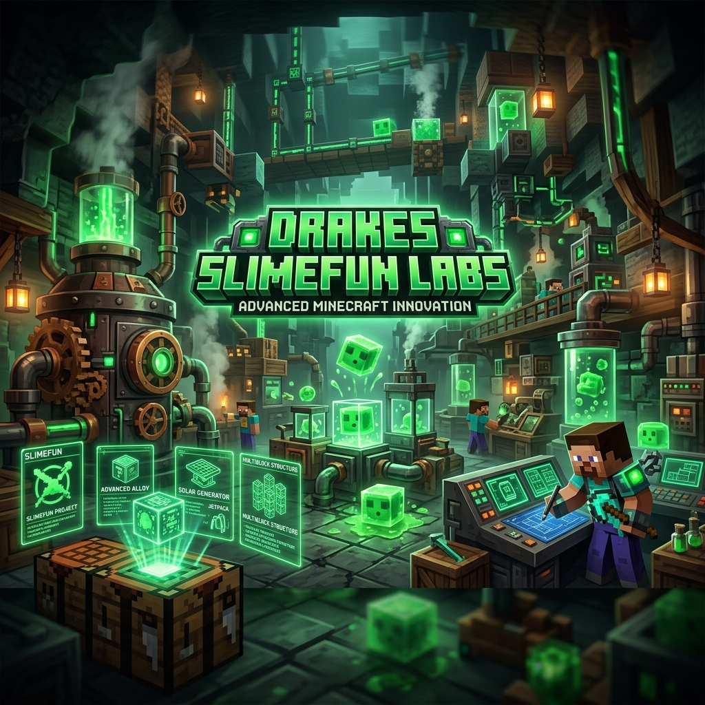

<div align="center">



# 🔬 Drakes Slimefun Labs
### *The Next Evolution of Slimefun Addons for Minecraft 1.21.11*

[](https://adoptium.net/)
[](https://papermc.io/)
[](https://github.com/Slimefun/Slimefun4)
[](LICENSE)

---

**Drakes Slimefun Labs** es el centro neurálgico de la migración masiva del ecosistema Slimefun. 
Aquí centralizamos el desarrollo de más de 35 addons, unificando dependencias y aplicando el **Drake Framework** para garantizar una estabilidad absoluta en la versión **1.21.11**.

[Explorar Checklist](MIGRATION_CHECKLIST.md) • [Arquitectura](ARCHITECTURE.md) • [Guía Técnica](docs/MIGRATION_GUIDE_1_21_11.md)

</div>

## 📊 Estado de la Migración

Actualmente, el laboratorio está procesando un reactor mono-repo con **53 módulos activos**.

**Progreso Total:**
`[====================>-------------] 60%`

| Métrica | Valor |
| :--- | :--- |
| 🚀 **Componentes Confirmados** | `32` |
| ⏳ **Módulos en Cola (Pending)** | `21` |
| 🛠️ **Framework Base** | `Slimefun 6 / Drake` |
| 📦 **Librería Core** | `dough-core:1.3.1-DRAKE` |

---

## 🏗️ Arquitectura del Laboratorio

Este no es un plugin convencional; es un **entorno de ingeniería modular**. El uso de un reactor Maven nos permite:

> [!TIP]
> **Aislamiento Inteligente**: Puedes compilar un único addon sin procesar todo el reactor usando el flag `-pl`.

*   **Centralización**: Versiones de Paper, Slimefun y Dough fijadas en el [pom.xml](pom.xml) raíz.
*   **Fixes en Cascada**: Un parche en el Core se propaga instantáneamente a todos los addons del Batch.
*   **Drake Framework**: Abstracciones nativas para Minecraft 1.21 (eliminando NMS legacy).

```powershell
# Comando maestro para validación de módulo
mvn -pl sources/repos-to-port/DynaTech -am -DskipTests package
```

---

## 🗺️ Mapa del Proyecto

<details>
<summary>📂 <b>Estructura de Carpetas (Click para expandir)</b></summary>

- `sources/`
  - `dough-core/`: El corazón del Drake Framework.
  - `slimefun-core/`: Nuestra versión evolucionada de Slimefun 4.
  - `repos-to-port/`: Addons principales (Batch 1).
  - `batch-2-expansion/`: Addons de expansión técnica (Batch 2).
  - `community-addons/`: Archivo de addons comunitarios recuperados.
- `scripts/`: Herramientas de automatización y Smoke Tests.
- `docs/`: Guías maestras de migración y handoffs.
</details>

---

## 🚀 Guías de Operación

¿Qué estás buscando hacer hoy?

*   🔍 **Ver qué addon está listo**: Mira el [MIGRATION_CHECKLIST.md](MIGRATION_CHECKLIST.md).
*   💻 **Entender los cambios en la API**: Lee la [Guía Técnica 1.21.11](docs/MIGRATION_GUIDE_1_21_11.md).
*   🧪 **Validar la salud del repo**: Ejecuta el [Smoke Test](docs/SMOKE_TEST.md).
*   📝 **Crear un nuevo addon**: Usa nuestro [Template Oficial](templates/slimefun-addon).

---

## 👥 Colaboradores y Créditos

Este proyecto es posible gracias al legado de grandes desarrolladores del ecosistema:

| Dev | Contribución |
| :--- | :--- |
| **TheBusyBiscuit** | Autor original de Slimefun 4. |
| **Sefiraat** | Mentor de las librerías de expansión y addons técnicos. |
| **Mooy1** | Creador de InfinityExpansion y arquitectura modular. |
| **Chagui68** | Variantes de compatibilidad y lógica de transición. |
| **[Pablo Elías](https://github.com/JackStar6677-1)** | Liderazgo del port 1.21.11 y creación del Drake Framework. |

---

<div align="center">
  <sub>Drakes Slimefun Labs es un proyecto independiente. Todas las marcas registradas pertenecen a sus respectivos dueños.</sub>
</div>
